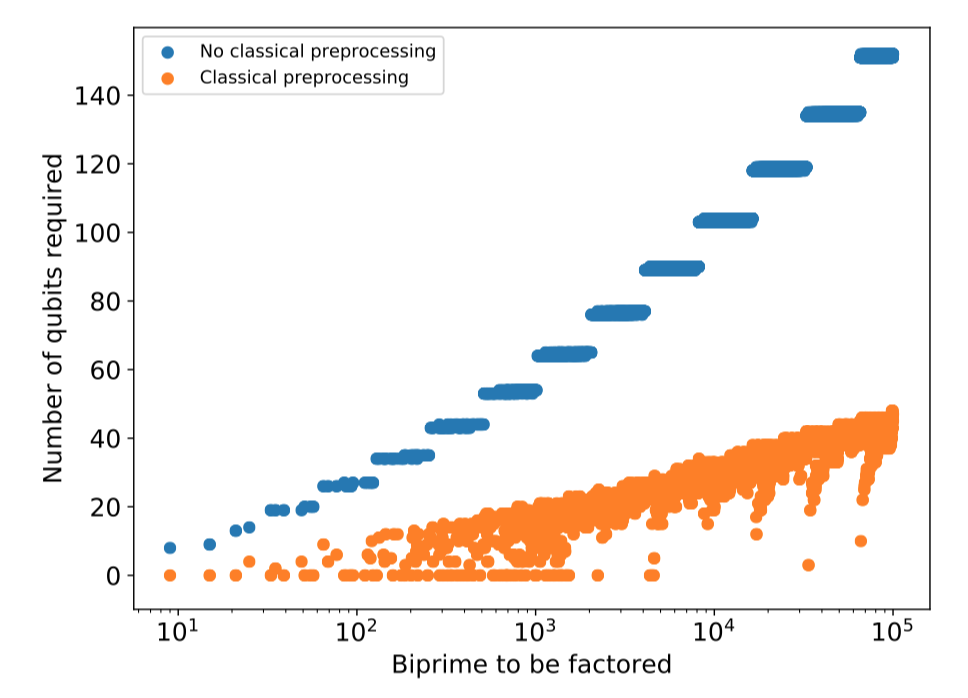
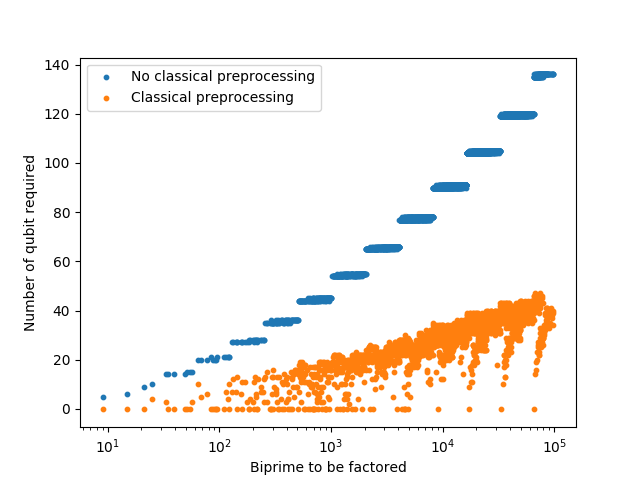
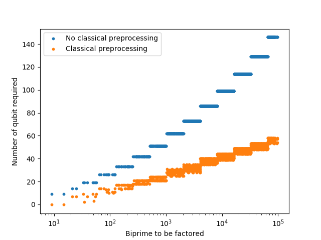

# Calculating amount of resources needed

## Goal of the experiment

The goal of this experiment was to evaluate preprocessing procedure and see how it reduces number of qubits required for running VQF algorithm.
My baseline here was Figure 1 from the VQF paper. I aimed to reproduce it by performing preprocessing on all the prime numbers until 1e5.

## Experiment overview

Current preprocessing scheme turns out to be more effective than one presented in VQF (see plots below). One rule that has not been described in the paper is "Z rule 2", which exploits the fact, that if some parts of the sum are even, other might be constrainted. The most basic example is: "x + y - 2 * z = 0", which implies that "x=y=z".

Another case I wanted to test was what is the difference in number of variables between case where we know a priori lenghts of the factors and when we don't.

Therefore I have performed three runs:
1. Preprocessing "as it is" - i.e. including 2nd Z-rule and the knowledge about the length of the factors
2. Preprocessing without 2nd Z-rule and with the knowledge about the length of the factors.
3. Preprocessing with 2nd Z-rule but without knowledge about the length of the factors.

I will refer to these as runs as "case 1", "case 2" and "case 3".
The results are stored in the results directory.

## Results

### Observation 1

In case 3 we still get a significant reduction in the number of variables needed. This case also seems to be much more predictable than case 1 and 2, when it comes to the number of variables that's needed. 

### Observation 2

I have not done proper analysis, but just from looking into the data it seems, that in case 1 and 2, when we see numbers above 10e4 which require very small number of variables, one of the factors is very small (3, 5 or 7). 

### Observation 3

Case 1 introduces some improvements over the original procedure from the paper, though it's hard to evaluate how much improvement it really is just from comparing the plots.

### Observation 4

In the absence of preprocessing it seems that the number of variables scales like a polynomial (square perhaps?) of number of bits of the number to factor.
With the introduction of preprocessing it seems to be linear, even in case 3, and even better for other cases.
However, this observation comes just from looking at the plots, not from a proper analysis, so keep in mind it might be wrong and not generalize well into higher numbers.

### Observation 5

There are still possible improvements in the preprocessing rules (e.g. see TODOs in the code).

### Observation 6

For the inspected data, on average, case 1 reduces the number of variables needed by 2.9, with respect to case 2, by 16.0 with respect to case 3.

### Original plot (Figure 1 in the paper)

### Case 1

### Case 2

### Case 3

## Conclusions

- Presented preprocessing procedure improves over the one presented in the paper
- Even without prior knowledge about the number of bits of p and q, preprocessing allows to reduce the number of variables significantly
- There is definitely still space for improvement in the preprocessing part of this algorithm, however it is hard to say if this will be a meaningful improvement (see observation 6).

