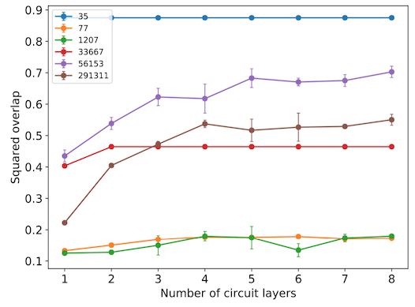
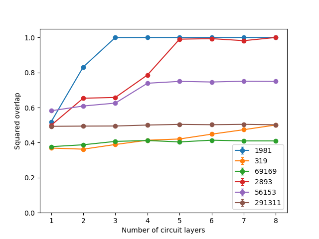
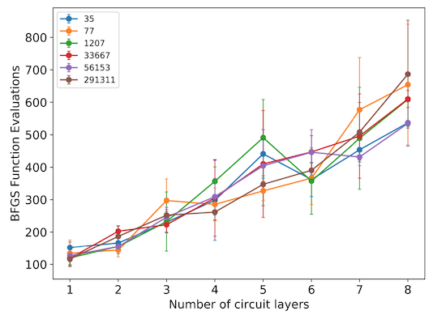

# Performance check - without noise

## Goal of the experiment

The goal of this experiment was to evaluate the performance of the VQF algorithm without the presence of noise. In order to do that I wanted to create plots corresponding to figures 2 and 3 from the original paper.

## Experiment overview

Since the goal of this experiment was to reproduce figures 2 and 3, I needed to run the VQF algorithm for each of the numbers, for `steps` parameter in range from 1 to 8, and gather data about the squared overlap of the resulting state and number of BFGS evaluations.

This, however, differed from the original research in some respects: 

1. Some of the numbers were different, due to differences in the preprocessing scheme (see experiment `2019_05_04_resources_needed`).
2. Simulation in this experiment did not involved noise.
3. The results of the simulation were deterministic, so there was no reason to run them more than once.

I used the same grid sizes as those provided in Table 1 in the original paper.

### 1. Number differences

Since differente preprocessing scheme was used, it was not possible to use the exact same number as in the original paper. Therefore I decided to choose numbers that required similar amount of resources. The only exception were numbers 56153 and 291311, since they used different preprocessing scheme proposed in [Quantum factorization of 56153 with only 4 qubits](https://arxiv.org/pdf/1411.6758.pdf). Since the claused proposed in this paper were pretty simple, I hope my implementation is the exact copy of the one from the article.

Other numbers used and their counterparts, in terms of number of qubits required and numbers of carry bits (see Table 1 from the original article):

- 1981 instead of 35 (1981 doesn't exhibit symmetry),
- 319 instead of 77 (both exhibit symmetry),
- 69169 instead of 1207 (69169 exhibits symmetry),
- 2893 instead of 33667 (both don't exhibit symmetry),
- 56153 - same as in the original research,
- 291311 - same as in the original research.

The order has been kept the same as in the original research, so it's easier to compare the plots.

### 2. Lack of noise

This was done for the sake of simplicity, gradation of difficulty and debugging purposes - indeed during the work on this experiment some critical bugs has been found and fixed, which would be much harder if simulation involved noise.

### 3. Deterministic results

What I mean by deterministic results is the fact, that no matter how many times I run the code, I always get the same angles. This doesn't mean, that the exact samples I get are the same - they differ slightly every time.

This probably comes from the absence of noise, and I will try to confirm it in the next experiment.

## Results

### Observation 1

The results are overall much better than in the original research - which is not particularly surprising, since the simulation was without noise.

### Observation 2

Comparing the numbers requiring two variables (1981 and 35), 1981 has much lower overlap for 1 and 2 layers. This might be caused by the differences in the clauses required for 35 and 1981, or lack of symmetry in the case of the latter.

### Observation 3

Not suprisingly, the more qubits are required for the factorization, the worse are the results. However, the relation isn't that simple and drawing definite conclusions from the results for only 6 numbers seems unwise.

### Observation 4

The results for 291311 don't change depending on the number of layers, the squared overlap stays at the level of 0.5 . This means, that the results for this implementation without noise are worse than for the original implementation with noise.
The reason for this is unknown and should be investigated.

### Observation 5

This implementation requires much, much higher number of BFGS evaluations. Scaling with the number of layers also seems to scale worse than linearly, though there is too little data to draw definite conclusions.
It's unclear to me where does the discrepancy in this regard comes from, perhaps from using different implementations of BFGS (I have used scipy implementation).

### Observation 6

In most (if not all) cases, the BFGS optimization ended with the error message: `Classical optimization exited with an error index: 2`. I was not able to find what "error index: 2" means, and it returns reasonable parameters, so it's hard to say what exactly doesn't work.

### Original squared overlap plot (Figure 2)

### Reproduced squared overlap plot 

### Original BFGS evaluations plot (Figure 3)

### Reproduced BFGS evaluations plot

## Conclusions

- This implementation of the VQF algorithm gives good results.
- The one exception to the statement above is for number 291311.
- There are reasons to think that the classical optimization (BFGS) needs improvement.
