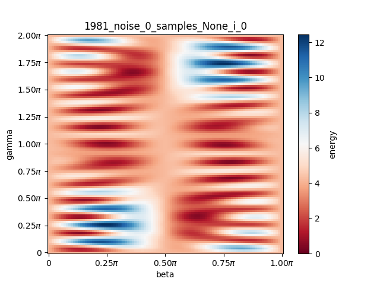
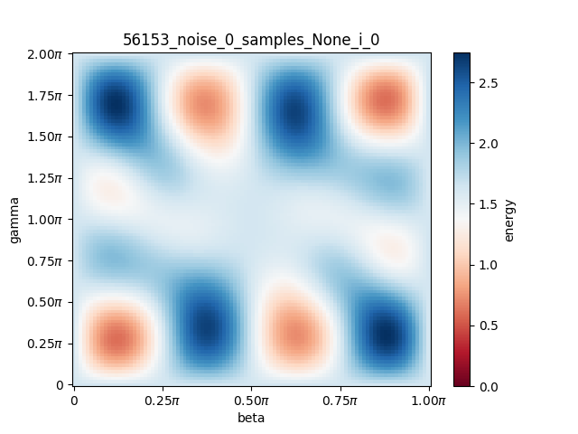
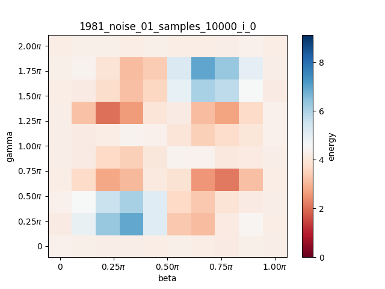
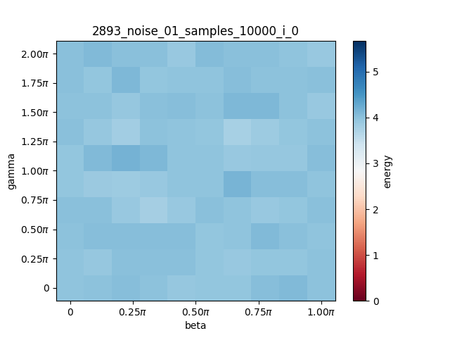
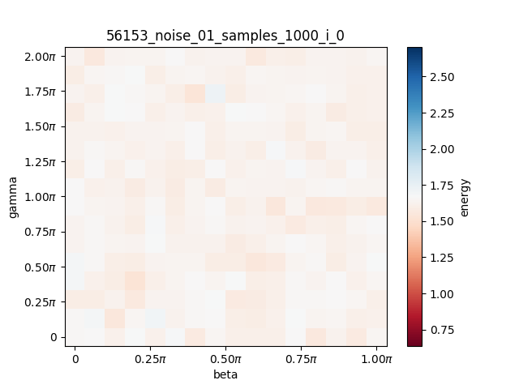
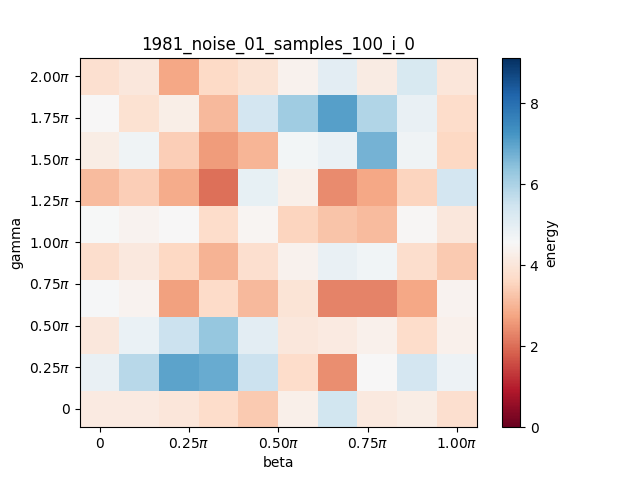
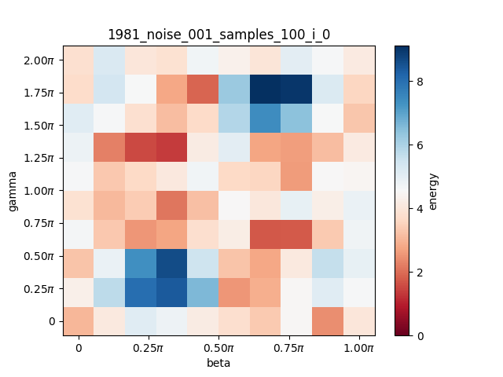
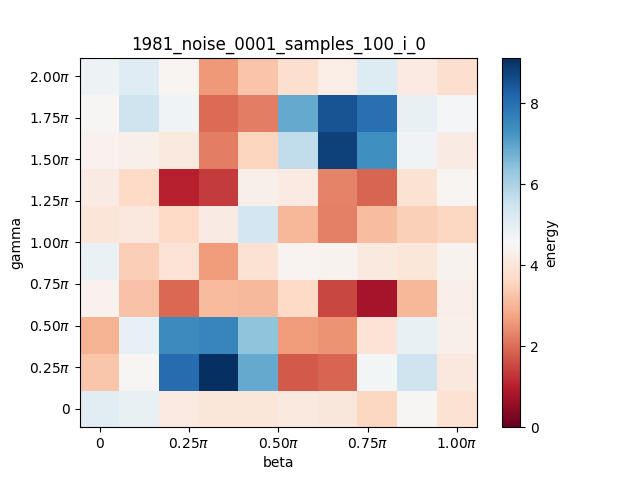

# Optimization space visualization

## Goal of the experiment

The goal of this experiment was to visualize the optimization space and see how it's affected by sampling and the presence of noise.

## Experiment overview

I decided to run simulations for three numbers: 1981, 2893 and 56153. 
I've chosen these numbers, because they didn't require many qubits to simulate, which affects time of the simulations.

I've chose the following paraters for the tests:
- gate noise: 0, 1e-4, 1e-3, 1e-2
- samples: 1e2, 1e3, 1e4

Grid sizes I used were equal to 10 for 1981 and 2893, and 16 for 56153.
The simulations for 1981 and 2893 were repeated 3 times, for 56153 only once (due to time constraints). I've also omited `samples=1e4` for 56153.

To have some reference I've also performed simulation without noise and sampling using 100 grid size.

## Results

Due to a large number of plots generated in this experiment, I decided to not include too many of them in the report. To analyze the plots yourself, please go to the `results.zip` file.
In this report I included only plots that I refer to in the observations.

### Observation 1

Looking at the optimization spaces of all the numbers (`all_numbers_grid_size_100`), it's clear that the optimization spaces of for 56153 and 291311 are less jagged than those for rest of the numbers.

### Observation 2

Comparing results for the grid size of 100 and 10, it's clear, that the grid size of 10 does not allow us to find the minima of the function. We might even end up in a local minimum which is separated by high local maxima from other, beter minimas (see the high resolution plot for 1981).

### Observation 3

For noise parameter 1e-2 the results for 56153 and 2893 are basically random. However, for 1981 some patterns emerge even for such high noise (see below).

### Observation 4

In most cases 100 samples was enough to identify where are the minima for given grid, even in the presence of noise.
However, 1000 samples gave more reliable data in this respect - with less false positives.

### Observation 5

Presence of noise doesn't seem to change the geometry of the optimization space - i.e. position of the optima. The main effect seems to be "flattening" the plot and adding random scatter (see plots below).
I think this point might require a wider comment.
We can think about the results as a function of two variables (beta and gamma). What I mean by flattening, is rescaling the values of this function towards some average value. So the shape stays the same - minima are in the same spots as they used to be - but the amplitude changes. This means, that even if this added random scatter is high, we should still be able to find the optima given enough samples.
Now that I've written this it seems intuitive, but I find it good to draw such conclusions from data, not only intuition.

### Observation 6

The differences between repeated simulations for the same error parameter and different number of samples:
- 100 samples: each repetition gives different result, which might result in not finding the right minimum
- 1000 samples: the differences are small and insignificant in distinguishing the position of the minimum
- 10000 samples: the differences are insignificant.

The higher error, the bigger are the differences, but the effect is small (excluding noise 1e-2, see observation 3).

### Observation 7

I was trying to connect the shape of optimization landscape to the form of the cost hamiltonian, but there is no obvious correlation - simple cost hamiltonians turn out to give complex patterns and vice versa. The hamiltonians can be found in `cost_hamiltonians.txt`.

### Observation 8

For the QAOA with only one step, the parameters which make the cost function go to 0 might simply not exist.

### High resolution plots without noise or sampling

### Results with high noise: 1e-2
Note that plot for 56153 is done with smaller number of samples, though bigger number of samples probably won't improve the results in this case.

### Results for 1981 with varying noise and 100 samples

## Conclusions

This experiment provides some insight into how the optimization space of the problems at hand look like. This might lead to a better procedure for the grid search part of the algorithm or better choice of the optimization algorithm.
For example, it seems that 1000 samples is enough for performing the grid search, since it suffice to find a good starting point for the optimization algorithm.
However, more research would be needed to understand the properties of the optimization space better. Also, keep in mind that the results of this research might not generalize to QAOA with more steps.

