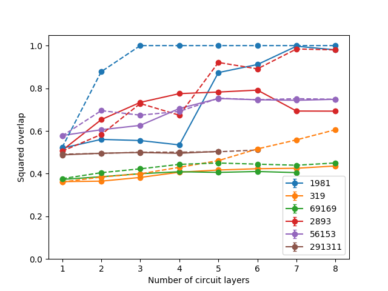
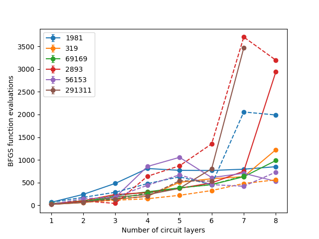
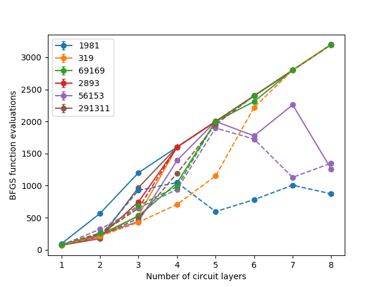

# Evaluating interp strategy

## Goal of the experiment

The goal of this experiment was to evaluate INTERP strategy for initializing the QAOA angles, as it has been presented in [Quantum Approximate Optimization Algorithm: Performance, Mechanism, and Implementation on Near-Term Devices](http://arxiv.org/abs/1812.01041), appendix B.1.

## Experiment overview

In order to evaluate the INTERP strategy I have used to in conjunction with 3 optimization algorithms: BFGS, L-BFGS-B and Nelder-Mead. 

Afterwards I have compared these results with the results obtained using previous optimization method (as presented in `2019_05_08_performance_checks`).

The article on which the strategy is based presents two strategies - INTERP and FOURIER. I've implemented only INTERP, since the authors state that it gives similar results for the small values of p.

For one run of BFGS we have also saved the values of angles produced (see `results/angles.txt`).

Some of the points in the plots are missing - this is caused by a bug in the current version of Forest SDK. It has been reported though not fixed yet.

## Results

Dashed lines in the plots represent results with the INTERP strategy. Solid lines are for the old results.

### Observation 1
The results are inconclusive - in some cases using INTERP strategy yields better results, in other the performance diminishes.

### Observation 2
This strategy allowed to improve on the case of 319 for around 10 percentage points - non of the previous changes improved on this case at all.

### Observation 3
When it comes to number of function evaluations, INTERP strategy is not a clear winner either. It allowed to lower the number of evaluations in some cases, though not in all of them.

### Observation 4
Looking at the values of angles (see `results/angles.txt`), the best angles found are not always changing monotonically (e.g. 1981), in the same pattern as described in the paper, though they do in most cases. 
However, this analysis was superficial and done using only one set of data, so it definitely requires more research and no strong conclusions can be drawn from this.

### Observation 5
Number of evaluation plots don't take into account the calculations for finding initial angles. Contrary to the previous strategy (step by step iterative brute force) INTERP doesn't require any calls to the quantum computer, so it definitely speeds up the calculation.
INTERP strategy also eliminates "grid size" parameter (except for the first call).

### Squared overlap plot (BFGS)

### Squared overlap plot (L-BFGS-B)

### Squared overlap plot (Nelder-Mead)

### Number of evaluations plot (BFGS)

### Number of evaluations plot (L-BFGS-B)

### Number of evaluations plot (Nelder-Mead)

## Conclusions

- INTERP initialization strategy seems to improve the results in some cases, though not the others.
- INTERP definitely reduces number of calls to the QC in the phase of finding initial angles (see observation 5).
- The behaviour of the angles is not always as model as one described in the original paper.
- These are only preliminary results, it requires further investigation.
